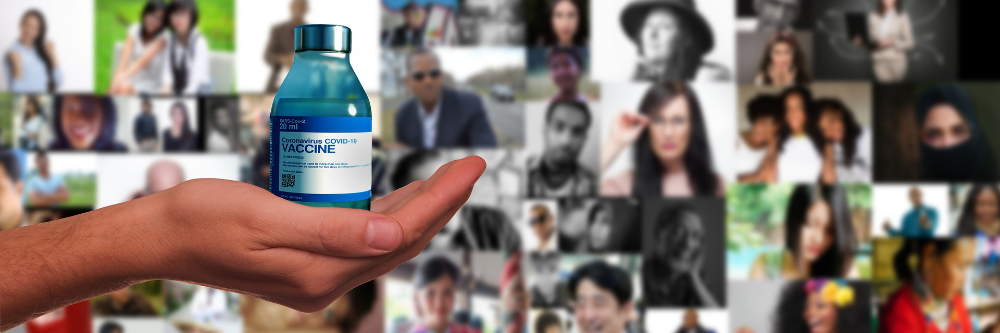

# COVID-19 Vaccination Project

This 4-week capstone project was carried out in March/April 2021 during the Data Science Bootcamp [@neuefische](https://www.neuefische.de) in Cologne (remote).

## Introduction

The coronavirus disease (COVID-19) is an infectious disease which is caused by a new coronavirus and was first detected in Q4 2019. As the disease spread around the globe it was declared a pandemic early in 2020. Now, a year later (March/April 2021), the effects of the global pandemic continues to affect and change the lives of each and everyone across the world. Whereas most people who contract the disease will experience mild to moderate respiratory illness and recover without requiring special treatment, especially the elderly, and those with underlying medical problems (e.g. cardiovascular disease, diabetes, chronic respiratory disease, cancer) are more likely to develop very serious conditions.

The way forward in fighting the disease it to vaccinate the world population!

A more detailed overview of the COVID-19 pandemic by the WHO can be accessed [here](https://www.who.int/health-topics/coronavirus#tab=tab_1).


## Objective

Key objectives of this COVID-19 Vaccination Project were:

1) Analyze and visualize the start of the vaccination progress worldwide
2) Patterns in vaccination tweets: numbers and sentiments
3) Connections: vaccination progress and vaccination tweets


## Datasets

The following datasets were utilised during this project:

1) Kaggle dataset on 'COVID-19 World Vaccination Progress' (country-wise data, version 81) [Link to up-to-date dataset](https://www.kaggle.com/gpreda/covid-world-vaccination-progress)

1) Population, GDP etc dataset

1) Worldwide tweets regarding COVID-19 vaccinations

The data spans a timeframe from mid-December 2020 to late March 2021.


## Table of Contents

### COVID-19 Vaccination Progress
1) Initial Data Exploration, Cleaning and Feature Engineering (including background information on vaccines) [link](https://github.com/BiBa-01/Capstone_Covid/blob/f49a910f3ffb04ddd04a8e2c8a4e628fe8f1e794/01_COVID_Vaccines.ipynb)
2) 2nd round data cleaning... merge with new dataset...
3) Basic Visualisations of Data Distribution [link](https://github.com/BiBa-01/Capstone_Covid/blob/f49a910f3ffb04ddd04a8e2c8a4e628fe8f1e794/03_COVID_Vaccines.ipynb)
4) Visualisations for In-Depth Data Analysis (1)
5) Visualisations for In-Depth Data Analysis (2) [link](https://github.com/BiBa-01/Capstone_Covid/blob/f49a910f3ffb04ddd04a8e2c8a4e628fe8f1e794/05_COVID_Vaccines.ipynb)
6) Feature Selection for Prediction and Time Series Specific EDA [link](https://github.com/BiBa-01/Capstone_Covid/blob/f49a910f3ffb04ddd04a8e2c8a4e628fe8f1e794/06_COVID_Vaccines.ipynb)
7) Triple Exponential Smoothing (Daily Vaccinations) [link](https://github.com/BiBa-01/Capstone_Covid/blob/f49a910f3ffb04ddd04a8e2c8a4e628fe8f1e794/07_COVID_Vaccines.ipynb)
8) SARIMA Model (Daily Vaccinations) [link](https://github.com/BiBa-01/Capstone_Covid/blob/f49a910f3ffb04ddd04a8e2c8a4e628fe8f1e794/08_COVID_Vaccines.ipynb)
9) FB Prophet (Daily Vaccinations) [link](https://github.com/BiBa-01/Capstone_Covid/blob/050ada568054380726ff9c0d0d1c31121a88750c/09_COVID_Vaccines.ipynb)
10) XX

### COVID-19 Tweets....
1) XXX

### COVID-19 Social Media Trends and Vaccination Progress
1) XXX

### Presentation

1) Project Overview [link](https://github.com/BiBa-01/Capstone_Covid/XXX)


## Results

In summary, XXXX


## Future Work

The key next steps are:
1) XXXX


## Environment

The virtual environment required for this repo can either be generated by running `make setup` and acivating the environment or by following the commands below.

```
pyenv local 3.8.5
python -m venv .venv
source .venv/bin/activate
pip install --upgrade pip
pip install -r requirement.txt
```

NOTE: Where?
%jupyter labextension install jupyterlab-plotly@4.14.3
%jupyter labextension install @jupyter-widgets/jupyterlab-manager plotlywidget@4.14.3
